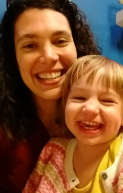

# R Workshop: August 26-27, 2017

This repository acts as a companion for the R programming portion of the  Software Carpentry Workshop being held at University of Arizona.

# Start Your Exciting R Adventure Here!

Every adventure starts with getting the supplies you need.  To prepare for the R portion of the workshop, you'll need to get the data we'll be using and some fancy addons to R!  


## 1. Clone the repo one of 2 ways

## Using git

There are two ways to do this, the first using the command line.

1. In your **Terminal** (Mac) or **Git Bash** (Windows), type `cd` and press `Enter`.  This takes you back to your home directory.
2. Identify your **home directory** on the command line (`pwd` to find your present working directory) 
3. On the [main page of the repo](https://github.com/gaiusjaugustus/intro-r-20170825), press the green button that says **Clone or download**.
4. Click the **copy to clipboard** button that is next to the URL
5. Back in your **terminal**, type `git clone URL` where the URL is the what is in your clipboard.
6. **Check your work** by using `ls` to verify that there is now a folder called `intro-r-20170825` in your home directory.


## Unzip the repo

1. Open **R Studio**.  You should see a box labelled `Console`, and there should be a `>` at the beginning of the line where you can type.  Type `getwd()` and `Enter` to find the directory you want to put the data into.  **Teaser:** This is the R equivalent of `pwd` in Unix.
3. On the [main page of the repo](https://github.com/gaiusjaugustus/intro-r-20170825), press the green button that says **Clone or download**.
4. Click the **Download Zip** link and download the file.
5. **Unzip the downloaded archive** into your home directory (that you identified in step 2).
6. **Check your work** by going to your home directory and verifying there is now a folder called `intro-r-20170825` there.


## 2. Install packages

Open RStudio and run the following lines of code in the box labelled `Console`.  You should see a `>` at the beginning of the line where you can type.  This installs additional functionality to R so that we can do all sorts of cool stuff!  **Note:** When you press `Enter` after putting in this command, it's going to take 3-6 minutes to install everything. Your patience will be rewarded.

```
install.packages(c("knitr", "scales", "ggthemes", "tidyverse", "readxl"))
```

**What did I just install?** You just added some great functionality to R.  These are called **packages**, and they work like addons or plugins.  `knitr` will allow you to create reports that are human readable and pretty that you can share with your boss, your parents, your dog...anyone.  `tidyverse` is a suite of packages that use more human readable code to import and manipulate data in R.  `readxl` lets you read in excel files, and while we won't cover it in this course, it's really useful and you should have it installed!  `scales` and `ggthemes` are two packages that add features to a plotting package that was downloaded as part of the `tidyverse` package, called `ggplot2`.  `ggthemes` adds color palettes and visual options, while `scales` allows us to customize a plot's axes more.

# What are we going to actually cover?

* [Day 1 Part 1: First baby steps](01_ImportingData.Rmd)
    * [What is R & R Studio?](01_ImportingData.Rmd#what-is-r)
    * [Importing datasets into dataframes](01_ImportingData.Rmd#reading-in-data)
    * [Manipulating data with dplyr](01_ImportingData.Rmd#dplyr)
* [Day 1 Part 2: Reporting and working through problems](02_HelpDataTypesFactors.Rmd)
     * [Getting Help and dealing with errors](02_HelpDataTypesFactors.Rmd#help-files)
     * [Data Types & Structures](02_HelpDataTypesFactors.Rmd#6-data-types)
     * [Factors](02_HelpDataTypesFactors.Rmd#factors)
     * [R Markdown Crash Course](02_HelpDataTypesFactors.Rmd#r-markdown)
* [Day 2 Part 3: Automating the automatron](03_ForLoopsIfElseFunctions.Rmd)
     * [For Loops](03_ForLoopsIfElseFunctions.Rmd#for-loops)
     * [If/Else Statements](03_ForLoopsIfElseFunctions.Rmd#if-else-statments)
     * [Writing Functions](03_ForLoopsIfElseFunctions.Rmd#functions)
* [Day 2 Part 4: Making pretties](04_Plotting.Rmd)
     * [base R plotting, a quick intro](04_Plotting.Rmd#plotting-is-essential-and-can-be-done-in-base-r)
     * [ggplot2 basics](04_Plotting.Rmd#ggplot2)
     * [Scatterplots](04_Plotting.Rmd#scatterplots)
     * [Histograms](04_Plotting.Rmd#histogram)
     * [Boxplots](04_Plotting.Rmd#boxplot)
     * [Barplots](04_Plotting.Rmd#barplot)
* [Day 2 Part 5: Sharing is caring](05_gitInRStudio.Rmd)
    * How to start a git repo in RStudio
    * How to push that repo to GitHub
* [Day 2 Part 6: Become a Jedi Master (or at least get more experience in writing R code & sharing on GitHub )](exercises/Day2_PM.Rmd)
    * Create an R Notebook
    * More advanced loops
    * More advanced plots
    * Get it all up onto GitHub
    * GitHub Pages so everyone can see your work

# A little help from our friends...

If you want more help, check out the [resource list](resources/CheatSheetsAndResources.Rmd).


# Your R instructors


[Gaius Augustus](http://www.gaiusjaugustus.com)


Elizabeth Bowman
